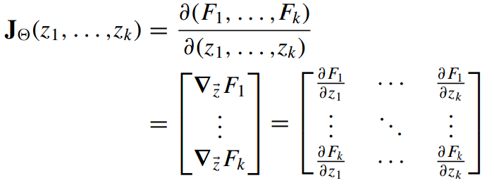
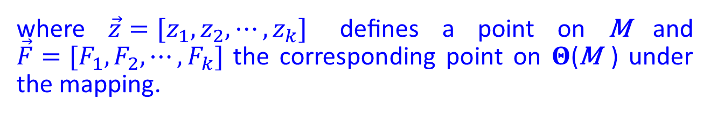

# Takens' reconstruction of dynamical attractors from time series
This repository provides the source code in /src for conducting delay embedding of a time series from a dynamical system, performing diffusion maps dimensionality reduction, and verifying the diffeomorphism of the reconstruction to the original attractor. Together with the code is the simple example of Lorenz attractor in /example_Lorenz, as a simple toy model to demonstrate the approach.

Full details of this protocol and its application to the reconstruction of molecular free energy surfaces from time-series measurements of experimentally-accessible observables are detailed in:

J. Wang and A.L. Ferguson "Nonlinear reconstruction of single-molecule free energy surfaces from univariate time series" Phys. Rev. E 93 032412 (2016) <http://link.aps.org/doi/10.1103/PhysRevE.93.032412>

## Lorenz attractor generation
The Lorenz attractor is a 3-dimensional dynamical system defined by the following coupled differential equations:
<p align="center">
<a href="https://www.codecogs.com/eqnedit.php?latex=\\&space;\frac{dx}{dt}=\sigma(y-x)\\&space;\frac{dy}{dt}=x(\rho-z)-y\\&space;\frac{dz}{dt}=xy-\beta&space;z\\" target="_blank"></a>
</p>


A 20581  3 dimensional matrix will be generated using `lorenz_generating.m` in Matlab employing parameter values  = 28,  = 10, and  = 8/3 to imbue the dynamical system with chaotic behavior:

```bash
>> [X] = lorenz_generating(28,10,8/3,[0 1 1.05],[0 100],0.000001);

>> Lorenz_full = X;
```

The Lorenz attractor is shown in Fig. 1. To control the size of the data, we evenly subsample 2000 points and generate a sparse version of the Lorenz attractor `Lorenz_sparse.mat`, we plot the full version `Lorenz_full.mat` and the sparse version `Lorenz_sparse.mat` together as shown in Fig. 1, using Matlab script `Plot_dmap.m`:

```bash
>> Plot_dmap;
```

<p align="center">
	
</p>
<p align="center">
	<em>Fig.1</em>
</p>

The Lorenz attractor plotting codes are adapted from those authored by Moiseev Igor: <https://www.mathworks.com/matlabcentral/fileexchange/30066-lorenz-attaractor-plot?focused=5176856&tab=function>

## Delay time and delay dimension

We select the x-component of the Lorenz time-evolution within the sparse Lorenz attractor to perform delay embeddings. When constructing delay embeddings it is important to select a good delay time  and delay dimension D. We use 'mutual information' (MI) to identify good delay time, and 'false nearest neighbor counting' to find a good delay dimension. An appropriate delay time is that at which MI drops to the first minima indicating that each new data point contains substantial new information. Applying `MI.m` to the sparse Lorenz trajectory, we identify  = 5 as a good delay time as illustrated in the top panel of Fig. 2.

We pick out x component of the sparse Lorenz attract as O:

```bash
>> O =  Lorenz_sparse(:,1);
```

and apply `MI.m` to O to generate MI plot, during which we select the number of bins to be 5, and maximum examined delay time to be 20:

```bash
>> MI(O);
```

As to identifying a good delay dimension, we use the E1 measurement in 'false nearest neighbor' method to identify the dimension at which E1 reaches a plateau and approaches unity. At this point, the delay embedding of the attractor has been fully unfolded, and there are no spurious neighbors due to artifacts of attractor recrossing due to incomplete unfolding. As shown in the bottom panel of Fig. 2, a sufficeint delay embedding dimensionality for the Lorenz x-component time series is D = 3.

We run

```bash
>> FNN(O);
```
then set the maximum dimension to exam to be 10, with delay time to be 5.

<p align="center">


</p>
<p align="center">
	<em>Fig.2</em>
</p>

For more about mutual information, refer to 
<https://doi.org/10.1103/PhysRevA.33.1134> and for false nearest neighbor embedding to <https://doi.org/10.1016/S0167-2789(97)00118-8>.

## Delay embedding of Lorenz attractor

Given a time series of a generic observable  from a dynamical system, Takens' delay embedding theorem the equivalent attractor can be reconstructed from the delay embedding: 

<p align="center">
<a href="https://www.codecogs.com/eqnedit.php?latex=Y(t)&space;=&space;[X(t),X(t-\tau),X(t-2\tau),\cdots,X(t-(D-1)\tau)]" target="_blank"></a>
</p>


In the previous steps, we have find a good delay time and delay dimension for `Lorenz_sparse` of  = 5 and D = 3 respectively, we can then construct the reconstructed delayed attractor using its x component:

```bash
>> RCT(O);
```

this will return a 1990  3-dimensional matrix `EBD.mat`. The reconstructed 3D attractor corresponding to this delay embedding is shown in Fig. 3.

<p align="center">

</p>
<p align="center">
	<em>Fig. 3</em>
</p>

See <https://doi.org/10.1016/0167-2789(86)90031-X> for more details.

## Dimensionality reduction of the reconstructed Lorenz attractor

It can be the case that the intrinsic dimensionality of the reconstructed dynamical system may be lower than the delay space in which it is embedded. In such instances, we must apply nonlinear manifold learning to extract the low-dimensional attractor from the high-dimensional delay space. In the present simple example this is not the case, since the delay-embedding reconstruction of the Lorenz attractor from the x-component of its time series is D = 3 that is identical to the dimensionality of the original Lorenz system. Accordingly, we need not perform this step here, but this could be done in the more general case using the diffusion map manifold learning technique. Application of this technique to the time-delayed attractor reconstruction may be performed as:

```bash
>> dMap(5,20,0,EBD);
```

and a gap in the eigenvalue specturm used to identify the number of eigenvectors that should be used to extract the intrinsic manifold of the reconstructed embedding.

For more about diffusion maps, refer to <https://doi.org/10.1073/pnas.0500334102> and <https://doi.org/10.1137/070696325>.

## Jacobian determinant

A map   which maps manifold M to   is a diffeomorphism (i.e., a topologically equivalent reconstruction that can be generated by a smooth and differentiable deformation) if the determinant of the Jacobian matrix is single signed. The Jacobian matrix is defined as:

<p align="center">


</p>

Takens' embedding theorem asserts that the reconsturcted attractor (Fig. 3) and the original one (Fig. 1) should be diffeomorphic. We can validate this numerically using the 'meshless' method to numerically compute the Jacobian determinant (detJ) of the mapping between these to attractors at each point over the manifold:

```bash
>> meshless_jacobian_3d;
```

This will return us the detJ computed for each point shown over the manifold (Fig. 5, top panel) and in temporal order (bottom panel). We disregard the early-time data t < 25 where the Lorenz trajectory is moving from its off-manifold initial condition to the stable attractor and exists in a sparsely-sampled off-manifold region of space where numerical estimates of the geometric properties are unreliable. Restricting our attention to the on-manifold sampling at t > 25, we observe that detJ is single-signed, proving that the reconstructed and original manifolds are, by the inverse function theorem, diffeomorphic and therefore topologically identical. The detJ is not, however, single-valued, demonstrating that the degree of stretching/squashing imposed on the reconstruction under the mapping  varies over the manifold, so the embeddings are not topographically identical.

<p align="center">


</p>
<p align="center">
	<em>Fig. 4</em>
</p>
